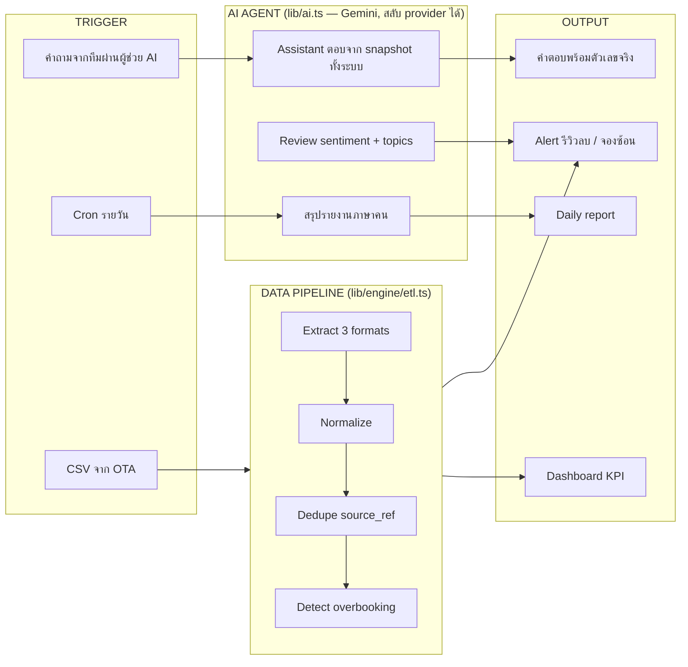

# Hotel Ops Console — AI Workflow & Automation Platform

ระบบหลังบ้านสำหรับ**ทีมบริหารโรงแรมมืออาชีพ (agency)** ที่ดูแลลูกค้าหลายโรงแรมพร้อมกัน —
สร้างเพื่อโชว์งาน **AI workflow / data pipeline / internal tool** แบบครบวงจรในโปรเจคเดียว

> โจทย์: เอเจนซี่บริหารโรงแรมจมงาน manual — ไล่เช็คราคาใน extranet ทีละ OTA, เปิดดูผลงานทีละโรงแรมทุกเช้า, ทำรายงานรายเดือนใน PPT หลายชั่วโมงต่อลูกค้าหนึ่งราย, งานหลุดในแชท
> คำตอบ: workspace เดียวที่ระบบชี้เป้าให้ว่าวันนี้ต้องโฟกัสที่ไหน และ AI ทำงานซ้ำๆ แทนใน 11 จุด

## ระดับเอเจนซี่ (portfolio ลูกค้า 6 โรงแรม)

| หน้า | ทำอะไร | จุดขาย |
|---|---|---|
| 📊 `/portfolio` | Performance ทุกโรงแรมเทียบเป้าในจอเดียว + rule-based alerts (occupancy หลุดเป้า, ยกเลิกพุ่ง, pickup ต่ำ, parity หลุด) | **AI briefing เช้า** — สรุปว่าวันนี้ทีมควรลงแรงโรงแรมไหนก่อน เรียงความสำคัญ |
| 🏨 `/properties` | Client Hub — ห้อง/rate plan/ผังเชื่อม OTA/ผู้ติดต่อ/ขอบเขตสัญญา + เช็กลิสต์ onboarding ลูกค้าใหม่ | ข้อมูลที่เคยกระจายในหัวพนักงานกับไฟล์แยกๆ รวมที่เดียว ทุกโมดูลดึงจากนี่ |
| ⚖️ `/channels` | ราคาทุก OTA ทุกโรงแรมหน้าเดียว + **ตรวจ rate parity อัตโนมัติ** (ต่างเกิน 3% = flag) | ไม่ต้อง login extranet ทีละอัน — เชื่อมผ่าน channel manager ไม่เก็บรหัส OTA เอง |
| ✅ `/tasks` | Task board ต่อโรงแรมต่อบริการ, งานประจำวนซ้ำอัตโนมัติ, เลยกำหนดเด้งแดง | เอเจนซี่พังเพราะ "งานหลุด" ไม่ใช่เพราะฝีมือ |
| 📅 `/marketing` | ปฏิทินคอนเทนต์/แคมเปญทุกลูกค้า + งบ + ผล + **AI คิดไอเดียคอนเทนต์** grounded ด้วยข้อมูลโรงแรม | รวมปฏิทินที่เคยแยกไฟล์กันมาไว้ที่เดียว |
| 🤝 `/crm` | Sales pipeline (เอเย่นต์/corporate/OTA deal) + เตือน follow-up | แทน Excel ที่ไม่มีใครเตือนให้ตามลูกค้า |
| 📄 `/reports` | **AI เขียนรายงานรายเดือนส่งลูกค้าทั้งฉบับ** จากตัวเลข+แคมเปญ+รีวิว+parity ของโรงแรมนั้น | งานหลายชั่วโมงต่อโรงแรม เหลือกดปุ่มเดียว |
| 💬 ผู้ช่วย AI (ปุ่มลอยทุกหน้า) | พนักงานถามอะไรก็ได้ — occupancy, parity, งานค้าง, ดีลที่ต้องตาม, รีวิวลบ — ตอบจาก **snapshot ข้อมูลจริงทั้งระบบ** | ไม่ต้องไล่เปิดทีละหน้า ถามประโยคเดียวได้คำตอบพร้อมตัวเลข + คุยต่อเนื่องได้ (ส่ง history) |

## Architecture



**หัวใจคือ abstraction 3 ชั้น** — ทุกโมดูลไม่เคยแตะ storage ตรงๆ:

| ชั้น | ไฟล์ | รายละเอียด |
|---|---|---|
| Data | `lib/db.ts` → `lib/store.ts` | **local JSON store** (`data/local-db.json`) — seed อัตโนมัติครั้งแรก, ทุก CRUD persist ข้าม restart, รีเซ็ตได้จาก sidebar · อยากย้ายไป DB จริงแก้ที่ `lib/db.ts` ไฟล์เดียว |
| AI | `lib/ai.ts` | เปลี่ยน LLM provider/model ที่จุดเดียว (ตอนนี้ Gemini 3.x) + auto-retry ตอน 429/503 |
| Transport | `app/api/assistant` | assistant engine ไม่รู้จักช่องทาง — ย้ายไป LINE OA / Slack / n8n webhook ได้โดยไม่แตะ engine |

**REST API** (validate ครบ ตอบ 400/404 พร้อมเหตุผล): `GET|POST /api/tasks` · `PATCH|DELETE /api/tasks/:id` · เช่นเดียวกับ `/api/leads` `/api/campaigns` · `PATCH /api/rates` (แก้ราคา OTA → ตรวจ parity ใหม่) · `PATCH /api/bookings/:id` (ยกเลิกการจอง) · `POST /api/admin/reset` — ทุกจุดลบ/ยกเลิกใน UI มี **confirmation modal**

## ระดับรายโรงแรม (สลับดูได้ทั้ง 6 ลูกค้า — ตัวเลือกโรงแรมบนทุกหน้า หรือ `?hotel=h3`)

| โมดูล | ทำอะไร | จุดที่ยาก |
|---|---|---|
| 🔀 ETL pipeline (`/ops`) | รวมไฟล์จอง 3 ช่องทางคนละฟอร์แมต + **AI แนะนำวิธีแก้จองซ้อน** | วันที่ ISO vs DD/MM/YYYY, คอลัมน์คนละชื่อ, แถวข้อมูลขาด → normalize + dedupe + จับ overbooking ด้วย interval overlap — ตอนแนะนำวิธีแก้ ระบบหาห้องว่างจริงช่วงนั้นป้อนให้ AI ไม่ให้เดา |
| ⭐ Review intelligence (`/reviews`) | AI แยก sentiment + หัวข้อปัญหา + **ร่างคำตอบรีวิวลบ** ในโทนแบรนด์ | รีวิวลบเด้งเป็น alert พร้อม topics + คำตอบพร้อมคัดลอกไปโพสต์ |
| 📊 Dashboard (`/dashboard`) | KPI bento + AI briefing + **AI Hotel Health Check** | Health Check อ่าน metrics 14 วัน + ช่องทางจอง + รีวิว แล้วให้คะแนน/เกรด พร้อมจุดแข็ง-ความเสี่ยง-สิ่งที่ควรทำทันที (สไตล์บริการตรวจสุขภาพโรงแรมของบริษัทที่ปรึกษา) |

**AI ทั้งหมด 11 จุด:** **ผู้ช่วย AI ประจำทีม (ถามได้ทุกเรื่อง คุยต่อเนื่องได้ — ปุ่มลอยทุกหน้า)** · วิเคราะห์รีวิว · ร่างตอบรีวิว · AI briefing รายโรงแรม · daily report (cron) · health check · แนะนำแก้จองซ้อน · **briefing เช้าทั้ง portfolio** · **รายงานรายเดือนทั้งฉบับ** · **ไอเดียคอนเทนต์การตลาด** · **ร่างข้อความ follow-up ลูกค้าใน CRM** — ทุกจุด grounded ด้วยข้อมูลจริงจากระบบ ไม่ปล่อยให้โมเดลเดาตัวเลข

## Quick start

```bash
npm install
npx tsx db/seed/raw-csv.ts     # สร้าง CSV ดิบ 3 ช่องทาง (จำลองไฟล์จาก OTA)
cat > .env.local <<'EOF'      # GEMINI_API_KEY ขอฟรีได้จาก Google AI Studio
NEXT_PUBLIC_DEMO_HOTEL_ID=h1
GEMINI_API_KEY=your_key_here
CRON_SECRET=dev-secret
EOF
npm run dev
```

เปิด http://localhost:3000 → กดรัน pipeline ที่ `/ops` → ดูตัวเลขที่ `/dashboard` → ถามผู้ช่วย AI จากปุ่มมุมขวาล่างได้ทุกหน้า

ทดสอบผ่าน API ตรงๆ:

```bash
curl -X POST localhost:3000/api/etl                    # → stats + overbooking conflicts
curl -X POST localhost:3000/api/reviews/analyze        # → sentiment + alerts
curl -X POST localhost:3000/api/assistant -H 'Content-Type: application/json' \
  -d '{"question":"โรงแรมไหน occupancy ต่ำกว่าเป้าบ้าง?"}'   # → ผู้ช่วย AI ตอบจากข้อมูลทั้งระบบ
curl -H "Authorization: Bearer dev-secret" localhost:3000/api/cron/daily-report
```

## Storage

เก็บข้อมูลเป็นไฟล์ local (`data/local-db.json`) — ไม่ต้องมี database ภายนอก
seed อัตโนมัติเมื่อรันครั้งแรก, ทุกการเพิ่ม/แก้/ลบ/ลาก persist ทันที,
ปุ่ม "รีเซ็ตข้อมูลเดโม" ใน sidebar ล้างกลับเป็น seed ของวันปัจจุบัน (ข้อมูล seed อิงวันที่ seed — เดโมนานๆ ครั้งกดรีเซ็ตให้วันที่สดใหม่)

## Stack

Next.js 16 (App Router) · TypeScript · Gemini API (`@google/genai`) · Local JSON store · Recharts · Tailwind v4 · Papa Parse · Vercel Cron

## Design decisions

- **เลือก code แทน n8n** เพราะ testability + version control — แต่โครงแยก transport ไว้ให้ trigger จาก n8n/webhook ได้
- **Dedupe ด้วย `source_ref`** (upsert idempotent) — รัน ETL ซ้ำกี่รอบข้อมูลไม่บวม
- **จับ overbooking ที่ pipeline** ไม่ใช่ที่ UI — ปัญหาถูกดักก่อนถึงหน้างาน
- **Chart palette ผ่าน colorblind-safe validator** (CVD ΔE ≥ 12, contrast ≥ 3:1)
